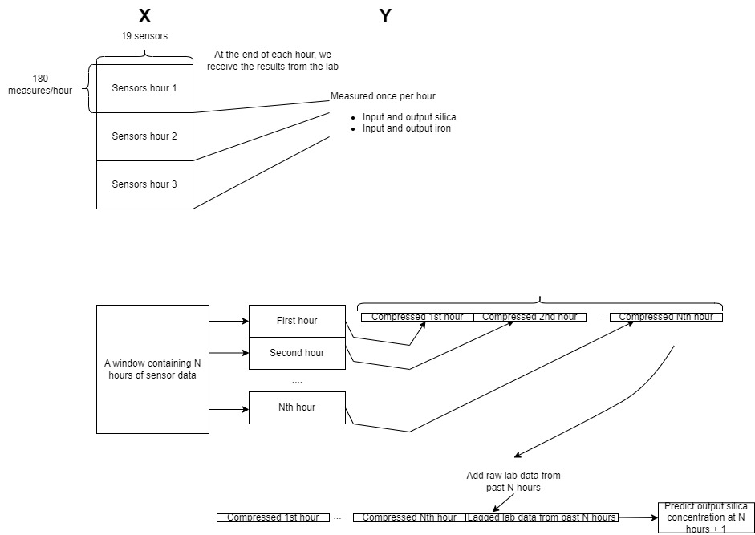
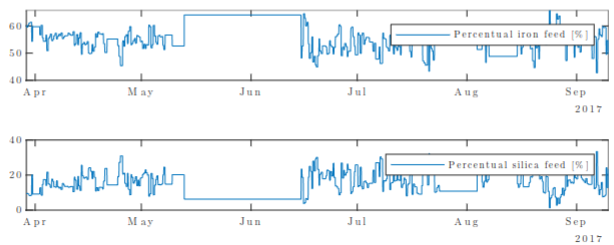
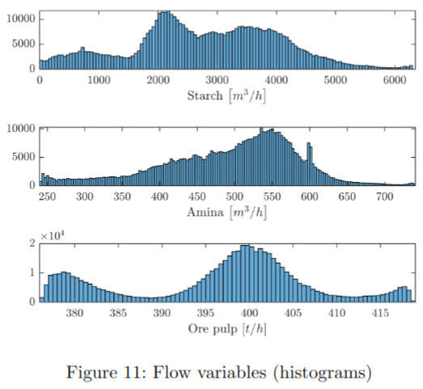
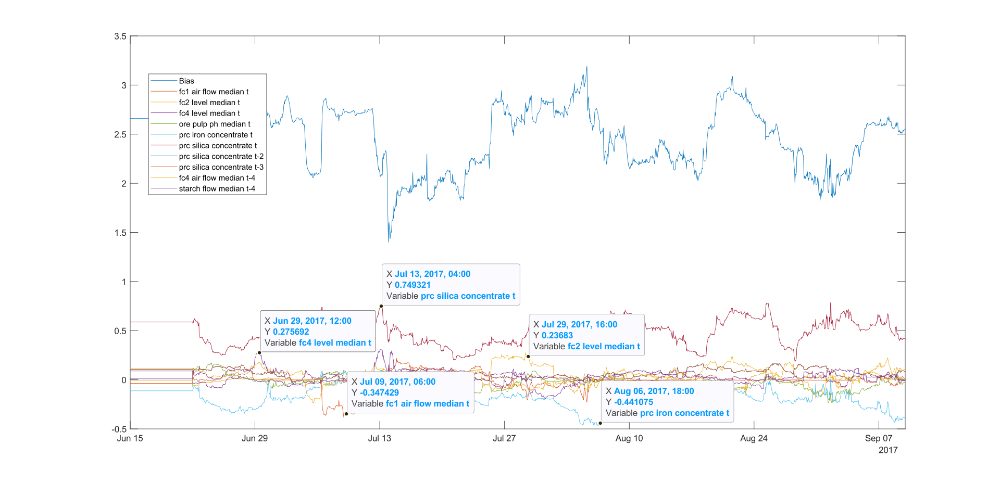

# Dynamic soft sensor for silica concentration

In this project we were tasked to develop a soft sensor for estimating the output silica concentration of a [froth flotation](https://www.sciencedirect.com/topics/earth-and-planetary-sciences/flotation-froth#:~:text=Froth%20flotation%20is%20a%20physicochemical,17) process. This is an important problem, since silica concentrate can not be measured automatically, this allows plant operators to better optimize the process by getting real time estimates of the silica concentration.

We were instructed to use dynamic linear models, that update their coefficients regularly during operation to adapt to quickly changing dynamics of the process.

## Data
Our data came from [Kaggle: Quality Prediction in a Mining Process](https://www.kaggle.com/datasets/edumagalhaes/quality-prediction-in-a-mining-process). The data consists of 24 variables - and a lot of problems.

Four of the variables are measured once an hour, since they require manual labor, while the other 20 sensors measure every 20 seconds. This causes a synchronization problem, which we fix by averaging the 20 second measurements over the hour. We also tried different feature extractions for the 'fast' variables, but found that they mainly confused the model.

There are also periods of abnormal functionality OR missing data (no documentation). We fix this by removing the periods of abnormal functionality which breaks the continuoity of the timeseries. We fix this by considering the remaining periods as separate timeseries for train/validation/test.

*Figure 1: Abnormal period in the iron feed*

## Modeling
For linear modeling we use [Partial Least Squares Regression](https://en.wikipedia.org/wiki/Partial_least_squares_regression). The benefit of this method, is that it can handle a lot of numerical problems, such as multicollinearity, and the results are highly interpretable, since the coefficients are linear combinations of the original features. This also allows us to study the importance of the individual sensors and lagged values for the prediction.

*Figure 2: PLS coefficients during inference with the dynamic model*

### Hyperparameter optimization
We had a script systematically testing different hyperparameters for the data selection and PLS model. We then selected the best model based on the R2 score.

